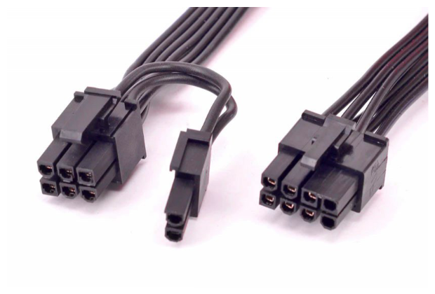

# Conector: PEG(PCI Express Graphics) de 6p y 8p

**Descripción breve:** Diseñados para alimentar tarjetas gráficas dedicadas.  
**Pines/Carriles/Voltajes/Velocidad:** 6 o 8 pines,+12V, hasta 150W(6p) 300W(8p)   
**Uso principal:** Alimentación de graficas  
**Compatibilidad actual:** Alta

## Identificación física
- Bloque rectangular de 6 o 8 pines con clip.

## Notas técnicas
- No confudir con el conector de la CPU.
- Las fuentes de alimentacion antiguas suelen traer solo de 6 pines.

## Fotos

## Fuentes
- [https://www.geeknetic.es](https://www.geeknetic.es/Conector-PEG/que-es-y-para-que-sirve)