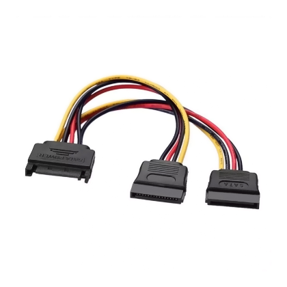

# Conector: SATA Alimentacion

**Descripción breve:** Alimenta unidades de almacenamiento (HDD y SSD).  
**Pines/Carriles/Voltajes/Velocidad:** 15 pines · +3.3V, +5V, +12V,hasta 54W  
**Uso principal:** Alimentación de la disco duros HDD y SDD.  
**Compatibilidad actual:** Alta

## Identificación física
- Bloque rectangular de 15 pines en forma de L tumbada.

## Notas técnicas
- Importante guiarse de la forma para saber el lado de conexion correctos.

## Fotos

## Fuentes
- [https://ibericavip.com](https://ibericavip.com/blog/pc-workstation/guia-para-principiantes-sobre-cables-sata-todo-lo-que-necesitas-saber/)