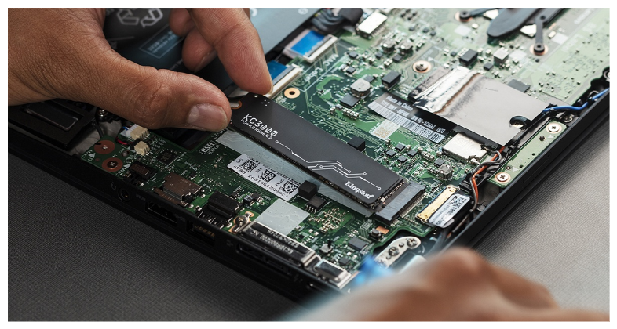

# Conector de datos: NVMe M.2 / SATA M.2 

**Descripción breve:** Interfaz de datos en serie para SATA y paralelelo para NVMe para conectar SSD. 
**Pines/Carriles/Voltajes/Velocidad:** Velocidad NVMe 5.0 PCIe hasta 15,76 GB/s /// SATA M.2 en version SATA III hasta 6GB/s 
**Uso principal:** Conexión de almacenamiento interno común  
**Compatibilidad actual:** Alta  

## Identificación física
- Conector plano , ranura con una muesca para NVMe M.2 o dos muescas para SATA M.2.

## Notas técnicas
- Ideal para edición de vídeo, videojuegos y usos que requieren alto rendimiento

## Fotos

## Fuentes
- [https://www.chuwi.com](https://www.chuwi.com/es/news/items/2834.html)
- [https://www.geeknetic.es](https://www.geeknetic.es/Guia/2189/SSD-M2-NVMe-y-SATA-Caracteristicas-y-Diferencias.html)