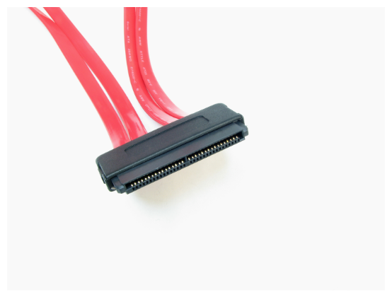

# Conector de datos: SAS (Serial Attached SCSI)

**Descripción breve:** Interfaz de datos en serie para conectar HDD/SSD/. 
**Pines/Carriles/Voltajes/Velocidad:** de 22 a 29 pines ·  (Conectores SFF-8482,SFF-8484) , SAS-4 22.5 Gbit/s 
**Uso principal:** Conexión de almacenamiento en servidores.  
**Compatibilidad actual:** Alta

## Identificación física
- Conector plano con muesca.

## Notas técnicas
- Hot-swap , alto rendimiento, velocidad ,fiabilidad y durabilidad.

## Fotos

## Fuentes
- [https://es.wikipedia.org](https://es.wikipedia.org/wiki/Serial_Attached_SCSI) 
- [https://blog.elhacker.net](https://blog.elhacker.net/2024/05/diferencias-unidades-disco-duro-sata-sas.html)