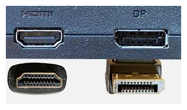

# Conector externo: DisplayPort 1.4-2.x

**Descripción breve:** interfaz digital moderna diseñada para transmitir tanto video como audio de alta calidad.  
**Pines/Carriles/Voltajes/Velocidad:**  1.4  8K a 60 Hz, 2.0 16k a 60Hz o 8k a 120Hz
**Uso principal:** común en monitores, ordenadores y tarjetas gráficas, especialmente en entornos profesionales y de gaming 
**Compatibilidad actual:** Alta

## Identificación física
- Ligeramente rectangular con un lado en ángulo (biselado), lo que evita conectarlo al revés.

## Notas técnicas
- Algunos cables incluyen un botón de presión para evitar desconexiones accidentales (no todos lo tienen).

## Fotos

## Fuentes
- [(https://en.wikipedia.org](https://en.wikipedia.org/wiki/DisplayPort)