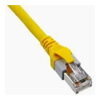

# Conector externo: RJ-45 (ethernet)

**Descripción breve:** RJ-45 es un estándar para conexiones de red cableadas (Ethernet)   
**Pines/Carriles/Voltajes/Velocidad:** 8pines, 100Mbps , 1Gbps , 10Gbps  
**Uso principal:** Conectar el ordenador a redes locales o Internet. 
**Compatibilidad actual:** Alta 

## Identificación física
-  Rectangular, más ancho que el conector telefónico (RJ-11)

## Notas técnicas
- Pestaña de plástico que fija el conector y evita desconexiones.

## Fotos

## Fuentes
- [https://es.wikipedia.org](https://es.wikipedia.org/wiki/RJ-45)