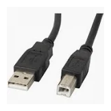

# Conector externo: USB-A 

**Descripción breve:** Conector USB clásico, el más común en ordenadores y periféricos.  
**Pines/Carriles/Voltajes/Velocidad:** USB 3.0 0.5A , USB 3.1 0.9A , +5V 
**Uso principal:** Ratones, teclados, discos externos, memorias USB.  
**Compatibilidad actual:** Alta 

## Identificación física
- Forma rectangular.

## Notas técnicas
- Hay diferentes versiones con diferentes colores dependiendo del fabricante.

## Fotos

## Fuentes
- [https://usb.org/](https://usb.org/)
- [https://www.profesionalreview.com](https://www.profesionalreview.com/2022/10/09/voltaje-usb/)
- [https://www.reparacion-ordenadores.com](https://www.reparacion-ordenadores.com/que-significan-los-colores-en-los-puertos-usb-de-un-pc/)