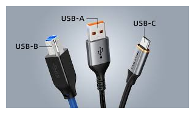

# Conector externo: USB-B 

**Descripción breve:** Menos común en dispositivos personales; típico en equipos más grandes.  
**Pines/Carriles/Voltajes/Velocidad:** +5V , 0.5a  
**Uso principal:** Impresoras, escáneres, dispositivos industriales  
**Compatibilidad actual:** Media

## Identificación física
- Menos común en dispositivos personales; típico en equipos más grandes.

## Notas técnicas
- Variante USB 3.0: Versión Tipo B con extensión adicional (más alta) e interior azul.

## Fotos

## Fuentes
- [https://usb.org/](https://usb.org)
- [https://www.geeknetic.es](https://www.geeknetic.es/USB-B/que-es-y-para-que-sirve)